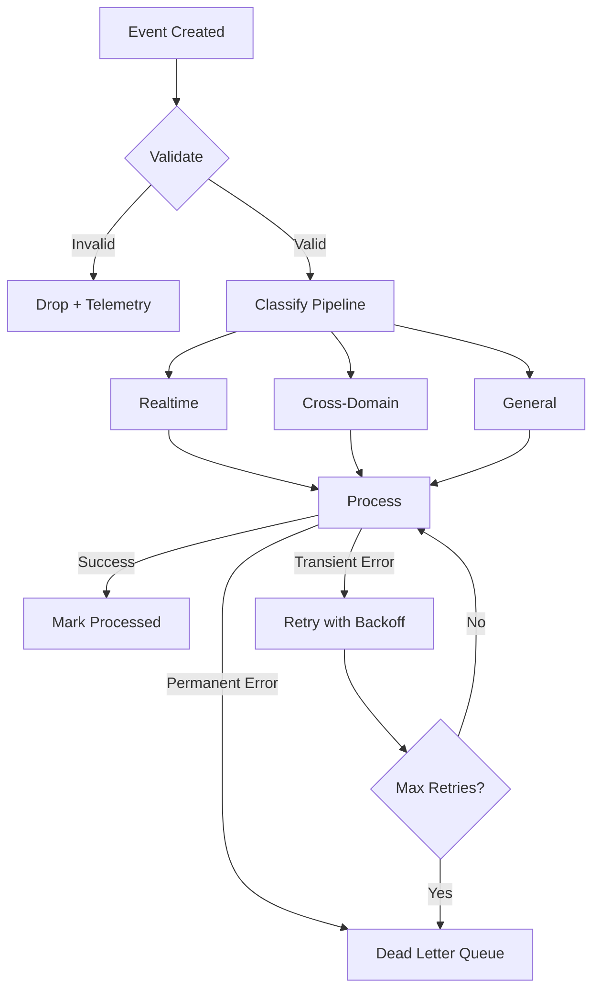

# 📚 Event Doc Agent Deployment Plan

**Agent ID:** `event-doc-agent`  
**Epic:** 3.3 Event System Validation  
**Priority:** 🟡 MEDIUM  
**Duration:** 2 hours  
**Can Run Parallel With:** event-test-agent, security-agent, session-agent  

## Mission
Document event flows, taxonomy, retry strategies, and create troubleshooting guide.

## Tasks

### Task 1: Event Flow Documentation (45 min)

**File:** `docs/EVENT_FLOWS.md`

```markdown
# Event Flows

## Event Taxonomy

All events follow pattern: `domain.category.action`

### Domains
- `system` - System-level events (startup, shutdown)
- `ui` - User interface events (clicks, navigation)
- `data` - Data operations (CRUD)
- `integration` - External service calls
- `flow` - Workflow events

### Categories by Domain
- `system`: health, config, flow
- `ui`: command, navigation, interaction
- `data`: create, read, update, delete
- `integration`: request, response, error
- `flow`: start, progress, complete, error

### Example Events
```elixir
# System events
"system.flow.tick"          # Heartbeat
"system.health.check"       # Health check

# UI events
"ui.command.click"          # Button click
"ui.navigation.page_view"   # Page navigation

# Data events
"data.create.user"          # User created
"data.update.post"          # Post updated

# Integration events
"integration.request.cerebros"   # Cerebros API call
"integration.response.cerebros"  # Cerebros response

# Flow events
"flow.start.nas_run"        # NAS run started
"flow.complete.nas_run"     # NAS run completed
```

## Event Structure

```elixir
%Event{
  id: "01JXXX-UUID",           # UUIDv7
  name: "data.create.user",    # Taxonomy name
  source: :thunderblock,       # Domain source
  payload: %{user_id: 123},    # Event data
  meta: %{
    pipeline: :general,        # :realtime | :cross_domain | :general
    priority: :normal,         # :critical | :high | :normal | :low
    correlation_id: "req-123"  # Request tracking
  },
  occurred_at: ~U[2025-11-01 12:00:00Z]
}
```

## Event Pipelines

### Realtime Pipeline
- **Purpose:** Time-sensitive events (UI interactions)
- **Latency:** < 50ms
- **Table:** realtime_events
- **Example:** ui.command.click

### Cross-Domain Pipeline
- **Purpose:** Events crossing domain boundaries
- **Latency:** < 100ms
- **Table:** cross_domain_events
- **Example:** data.create.user (affects multiple domains)

### General Pipeline
- **Purpose:** Standard async events
- **Latency:** < 500ms
- **Table:** events
- **Example:** integration.request.cerebros
```

---

### Task 2: Retry Strategy Documentation (30 min)

**File:** `docs/EVENT_RETRY_STRATEGIES.md`

```markdown
# Event Retry Strategies

## Error Classification

### Transient Errors (RETRY)
- Network timeouts
- Database connection errors
- Temporary service unavailability
- Rate limiting

**Action:** Retry with exponential backoff

### Permanent Errors (FAIL)
- Invalid event structure
- Authorization failures
- Business rule violations
- Data validation errors

**Action:** Log and move to dead letter queue

### Unknown Errors (RETRY with caution)
- Unexpected exceptions
- Unclassified errors

**Action:** Retry 3 times, then fail

## Backoff Algorithm

```elixir
backoff_ms = base_delay * (2 ^ attempt) + random_jitter

# Example progression
attempt 1: 1000ms + jitter(0-200ms)  = ~1000-1200ms
attempt 2: 2000ms + jitter(0-400ms)  = ~2000-2400ms
attempt 3: 4000ms + jitter(0-800ms)  = ~4000-4800ms
attempt 4: 8000ms + jitter(0-1600ms) = ~8000-9600ms
attempt 5: 16000ms (cap at max_backoff)
```

## Max Retries
- Default: 5 attempts
- Configurable per event type
- After max retries: Event moved to dead letter queue

## Dead Letter Queue
- Failed events stored for manual review
- Includes failure reason and context
- Can be replayed after fixing underlying issue

## Monitoring
- Retry rates tracked via telemetry
- Alerts on high failure rates
- Dashboard shows retry patterns
```

---

### Task 3: Troubleshooting Guide (30 min)

**File:** `docs/EVENT_TROUBLESHOOTING.md`

```markdown
# Event System Troubleshooting

## Common Issues

### Events Not Being Published

**Symptom:** Events disappear, no telemetry

**Causes:**
1. Invalid event structure
2. Taxonomy validation failure
3. Database connection issue

**Debug:**
```elixir
# Check event validation
{:error, reason} = EventBus.publish_event(event)

# Check telemetry
:telemetry.list_handlers([:thunderline, :event])

# Check database
Thunderline.Repo.query!("SELECT COUNT(*) FROM events")
```

**Fix:**
- Validate event structure matches schema
- Check event name follows taxonomy (lowercase.with.dots)
- Verify database connection

---

### Events Stuck in Retry Loop

**Symptom:** Same event retrying repeatedly

**Causes:**
1. Transient error not resolving
2. Error classification incorrect
3. Max retries too high

**Debug:**
```elixir
# Check event processor state
EventProcessor.get_failing_events()

# Check error classification
EventProcessor.classify_error(exception)

# Check retry count
event.meta.retry_count
```

**Fix:**
- Classify permanent errors correctly (stop retrying)
- Fix underlying issue (database, service)
- Manually move to dead letter queue if needed

---

### High Event Processing Latency

**Symptom:** Events taking too long to process

**Causes:**
1. Database slow queries
2. Too many events in queue
3. Processor overloaded

**Debug:**
```bash
# Check queue depth
SELECT pipeline, COUNT(*) FROM events 
WHERE processed_at IS NULL 
GROUP BY pipeline;

# Check processing times
SELECT AVG(processed_at - occurred_at) 
FROM events 
WHERE processed_at IS NOT NULL;
```

**Fix:**
- Add database indexes
- Scale processors horizontally
- Use realtime pipeline for urgent events

---

### Missing Telemetry Events

**Symptom:** Dashboards empty, no metrics

**Causes:**
1. Telemetry not attached
2. Handler crashed
3. Wrong event names

**Debug:**
```elixir
# List attached handlers
:telemetry.list_handlers([:thunderline])

# Re-attach handler
:telemetry.attach(...)

# Test emit
:telemetry.execute([:thunderline, :event, :test], %{}, %{})
```

**Fix:**
- Ensure handlers attached on startup
- Check handler functions don't crash
- Verify event names match [:thunderline, :event, ...]
```

---

### Task 4: Event Flow Diagrams (15 min)

**File:** `docs/diagrams/event_flow.mmd`



---

## Deliverables

- [ ] `EVENT_FLOWS.md` - Taxonomy, structure, pipelines
- [ ] `EVENT_RETRY_STRATEGIES.md` - Retry logic, backoff, DLQ
- [ ] `EVENT_TROUBLESHOOTING.md` - Common issues & fixes
- [ ] `diagrams/event_flow.mmd` - Visual flow diagram
- [ ] All documentation comprehensive and clear

## Success Criteria
✅ Event taxonomy fully documented  
✅ Retry strategies explained  
✅ Troubleshooting guide practical  
✅ Diagrams clarify complex flows  
✅ Easy for devs to understand  

## Blockers
- ❌ Event system implementation unclear → Interview engineers
- ❌ Retry logic not finalized → Document current + planned
- ❌ Telemetry events unknown → Scan code for emitted events

## Communication
**Report When:**
- Event flows documented (45 min mark)
- Retry strategies documented (75 min mark)
- Troubleshooting guide complete (105 min mark)
- Diagrams created (120 min mark)

**Estimated Completion:** 2 hours  
**Status:** 🟢 READY TO DEPLOY
