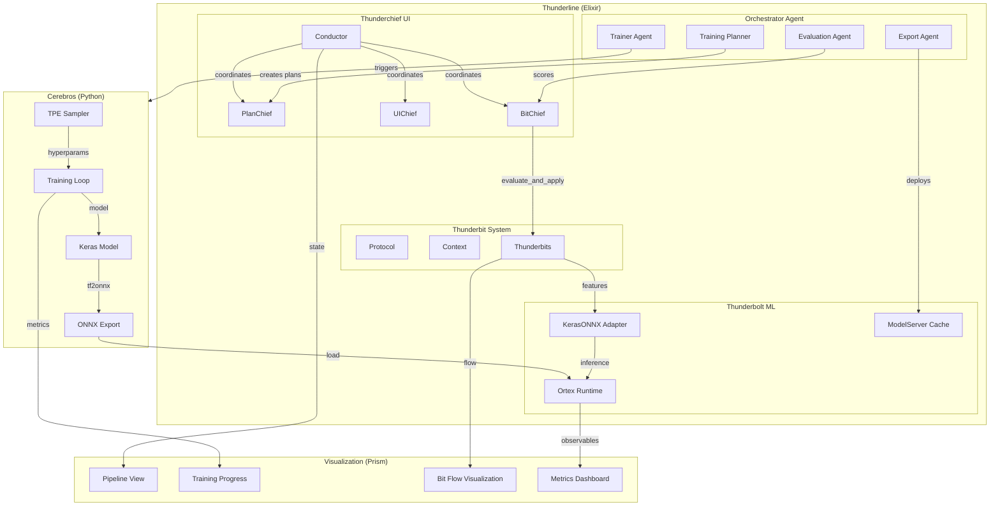

# Boss 4: ML Training Pipeline Architecture

**Goal**: Define a visualizable, end-to-end ML training pipeline that integrates Cerebros TPE/Keras → ONNX → Ortex inference with Thunderbits and Thunderchief orchestration, enabling agent self-improvement via orchestrator collaboration.

---

## 1. High-Level Architecture



---

## 2. Component Breakdown

### 2.1 Cerebros (Python Side)

**Location**: `python/cerebros/`

| Component | Purpose | Key Functions |
|-----------|---------|---------------|
| `service/tpe_bridge.py` | Optuna TPE hyperparameter optimization | `init_study`, `suggest`, `record`, `best_params` |
| `service/cerebros_service.py` | Main training service | `train_model`, `evaluate`, `export_onnx` |
| `onnx/convert.py` | Keras → ONNX conversion | `convert_single_model`, `batch_convert` |
| `core/cerebros/` | Neural architecture definitions | Model builders, layers |

**Data Flow**:
```
TPE Suggest → Train Keras Model → Evaluate → Record Result → Loop → Export Best to ONNX
```

### 2.2 Thunderbolt ML (Elixir Side)

**Location**: `lib/thunderline/thunderbolt/ml/`

| Module | Purpose |
|--------|---------|
| `KerasONNX` | ONNX inference via Ortex |
| `ModelServer` | Session caching GenServer |
| `Input/Output` | Type-safe ML I/O contracts |

**Key Integration Points**:
- `KerasONNX.load!/2` → Load ONNX model
- `KerasONNX.infer/3` → Run inference
- `compute_observables/2` → PLV/σ/λ̂ metrics for edge-of-chaos monitoring

### 2.3 Thunderbit System

**Location**: `lib/thunderline/thunderbit/`

| Module | Purpose |
|--------|---------|
| `Protocol` | 7 core verbs: spawn, bind, link, step, retire, query, mutate |
| `Context` | Immutable context threading |
| `Category` | Bit categorization (sensory, cognitive, motor, etc.) |
| `Wiring` | Valid bit connection rules |

**Training Integration**:
1. Thunderbits emit **trajectory data** (state → action → reward → next_state)
2. `BitChief.observe_state/1` extracts features for scoring
3. `CerebrosBridge.evaluate_and_apply/2` runs ONNX inference on bits
4. Results mutate bit attributes (score, label, action suggestions)

### 2.4 Thunderchief Orchestration

**Location**: `lib/thunderline/thunderchief/`

| Chief | Responsibility |
|-------|----------------|
| `Conductor` | Orchestrates all chiefs on tick |
| `BitChief` | Thunderbit domain management |
| `VineChief` | DAG/workflow orchestration |
| `UIChief` | UI state synchronization |
| `PlanChief` | Training plan execution |
| `CrownChief` | Policy/governance |

**Training Orchestration Pattern**:
```elixir
# Conductor tick flow
on_tick ->
  BitChief.observe_state(ctx)
  |> BitChief.choose_action()
  |> BitChief.apply_action()
  |> Logger.log_trajectory()  # For Cerebros training
```

### 2.5 Orchestrator Agents

**Proposed**: `lib/thunderline/thunderchief/orchestrator/`

Multi-agent system for coordinating training:

| Agent | Role |
|-------|------|
| `TrainingPlannerAgent` | Creates training curricula, selects what to train |
| `EvaluationAgent` | Scores model performance, detects degradation |
| `TrainerAgent` | Triggers Python training, monitors progress |
| `ExportAgent` | Deploys trained ONNX models to ModelServer |
| `OrchestratorAgent` | Coordinates other agents, resolves conflicts |

**Collaboration Protocol**:
```elixir
# Agent message passing via events
{:training_request, %{curriculum: curriculum, epochs: 100}}
{:evaluation_complete, %{model_id: id, score: 0.87}}
{:export_ready, %{onnx_path: path, version: "1.0"}}
```

---

## 3. Training Pipeline Stages

### Stage 1: Data Collection (Thunderbit Trajectories)

```elixir
# In BitChief or Protocol
defp log_trajectory(logger, chief, prev_state, action, next_state, outcome) do
  step = %{
    state: State.to_features(prev_state),
    action: action,
    reward: calculate_reward(outcome),
    next_state: State.to_features(next_state),
    done: false,
    metadata: %{tick: prev_state.tick, chief: chief}
  }
  TrajectoryLogger.log_step(chief, step, server: logger)
end
```

**Storage Options**:
- Mnesia tables (existing infrastructure)
- Ash.Events (persistent event log)
- File export to `priv/training_data/trajectories/`

### Stage 2: Feature Engineering

**Thunderbit Feature Vector** (from `CerebrosFacade.Mini.Feature`):
- `bit_id`, `category`, `role`
- `energy`, `salience`
- `content_len`, `tag_count`
- `depth`, `siblings`, `children`
- `time_since_spawn`, `transition_count`

**Extension for Training**:
```elixir
defmodule Thunderline.Thunderbolt.Training.FeatureExtractor do
  def extract_training_features(bit, context) do
    base = Feature.from_bit(bit)
    extended = %{
      base |
      context_energy: Context.total_energy(context),
      active_bit_count: Context.active_count(context),
      chain_depth: bit.chain_depth,
      cerebros_score: bit.cerebros_score
    }
    {:ok, extended}
  end
end
```

### Stage 3: TPE Hyperparameter Optimization

**Elixir → Python Bridge** (via Snex or Port):

```elixir
defmodule Thunderline.Thunderbolt.Training.TPEClient do
  def init_study(name, search_space, opts \\ []) do
    call_python(:tpe_bridge, :init_study, [name, search_space, opts])
  end

  def suggest(name), do: call_python(:tpe_bridge, :suggest, [name])
  
  def record(name, params, value), do: call_python(:tpe_bridge, :record, [name, params, value])
  
  def best_params(name), do: call_python(:tpe_bridge, :best_params, [name])
end
```

**Search Space for Agent Scoring Model**:
```python
search_space = [
    {"name": "learning_rate", "type": "float", "low": 1e-5, "high": 1e-2, "log": True},
    {"name": "hidden_dim", "type": "int", "low": 32, "high": 256, "step": 32},
    {"name": "num_layers", "type": "int", "low": 1, "high": 4},
    {"name": "dropout", "type": "float", "low": 0.0, "high": 0.5},
    {"name": "activation", "type": "categorical", "choices": ["relu", "gelu", "swish"]},
]
```

### Stage 4: Keras Model Training

```python
# cerebros/service/agent_trainer.py
def train_agent_model(hyperparams, trajectory_data, epochs=100):
    model = build_scoring_model(hyperparams)
    
    # Prepare data
    X = np.array([t["state"] for t in trajectory_data])
    y = np.array([t["reward"] for t in trajectory_data])
    
    # Train
    history = model.fit(X, y, epochs=epochs, validation_split=0.2)
    
    return model, history
```

### Stage 5: ONNX Export

```python
# Use existing converter
from cerebros.onnx.convert import convert_single_model

onnx_path, metadata = convert_single_model(
    "agent_scoring_v1.keras",
    output_dir="priv/models/",
    max_seq_length=40,  # Feature vector size
    verify=True
)
```

### Stage 6: Elixir Deployment via Ortex

```elixir
# Hot-reload new model
defmodule Thunderline.Thunderbolt.Training.ModelDeployer do
  def deploy_model(onnx_path, version) do
    # Update ModelServer with new model
    ModelServer.update_model("agent_scoring", onnx_path)
    
    # Notify via event
    EventBus.publish_event(%{
      name: "ml.model.deployed",
      source: :training_pipeline,
      payload: %{model: "agent_scoring", version: version, path: onnx_path}
    })
  end
end
```

---

## 4. Visualization Design (Thunderprism)

### 4.1 Pipeline View (`/training/pipeline`)

Shows the current state of the training pipeline:

```
┌─────────────────────────────────────────────────────────────────┐
│ Training Pipeline: agent_scoring_v2                              │
├─────────────────────────────────────────────────────────────────┤
│                                                                  │
│  [Collect] ──▶ [Feature] ──▶ [TPE] ──▶ [Train] ──▶ [Export]    │
│     ✓           ✓            ◉         ○          ○            │
│                                                                  │
│  ◉ = In Progress   ✓ = Complete   ○ = Pending                   │
│                                                                  │
│  Current Trial: 7/25                                             │
│  Best Score: 0.847                                               │
│  ETA: ~12 minutes                                                │
└─────────────────────────────────────────────────────────────────┘
```

### 4.2 Training Progress (`/training/progress`)

Real-time metrics:

```
┌─────────────────────────────────────────────────────────────────┐
│ Training Progress                                                │
├─────────────────────────────────────────────────────────────────┤
│                                                                  │
│  Loss: ████████████░░░░░░░░░░░░░░ 0.234                         │
│                                                                  │
│  Accuracy                      PLV                               │
│  ▲ 0.87                       ▲ 0.52                            │
│  │ ╭───────────╮              │ ╭───╮                           │
│  │╭╯           ╰──            │╭╯   ╰───────                    │
│  └───────────────▶            └───────────▶                      │
│      epochs                       epochs                         │
│                                                                  │
│  σ (Entropy)                   λ̂ (Stability)                     │
│  ▲ 0.78                       ▲ 0.02                            │
│  │───────────────             │     ╭───                         │
│  └───────────────▶            └────╯────▶                        │
│                                                                  │
└─────────────────────────────────────────────────────────────────┘
```

### 4.3 Bit Flow Visualization (`/training/bits`)

Thunderbit state during evaluation:

```
┌─────────────────────────────────────────────────────────────────┐
│ Thunderbit Evaluation Flow                                       │
├─────────────────────────────────────────────────────────────────┤
│                                                                  │
│     ┌──────────┐      ┌──────────┐      ┌──────────┐           │
│     │ Sensory  │──────│ Cognitive│──────│  Motor   │           │
│     │  ●●●●○   │      │   ●●●○   │      │   ●●○    │           │
│     │ score:87 │      │ score:72 │      │ score:95 │           │
│     └──────────┘      └──────────┘      └──────────┘           │
│                                                                  │
│  Active Bits: 23    Pending: 12    Evaluating: 3                │
│                                                                  │
│  Recent Evaluations:                                             │
│  • bit_a7f3: sensory → 0.87 (activate_pending)                  │
│  • bit_c2e1: cognitive → 0.72 (transition)                      │
│  • bit_f9d2: motor → 0.95 (checkpoint)                          │
│                                                                  │
└─────────────────────────────────────────────────────────────────┘
```

### 4.4 Agent Collaboration View (`/training/agents`)

Multi-agent orchestration status:

```
┌─────────────────────────────────────────────────────────────────┐
│ Orchestrator Agents                                              │
├─────────────────────────────────────────────────────────────────┤
│                                                                  │
│  ┌───────────┐                                                   │
│  │Orchestrator│◀────────────────────────────────────────────┐   │
│  │   ●IDLE   │                                              │   │
│  └─────┬─────┘                                              │   │
│        │                                                    │   │
│  ┌─────┴───────┬───────────┬───────────┐                   │   │
│  ▼             ▼           ▼           ▼                   │   │
│ ┌─────────┐ ┌─────────┐ ┌─────────┐ ┌─────────┐           │   │
│ │ Planner │ │Evaluator│ │ Trainer │ │Exporter │           │   │
│ │ ●ACTIVE │ │ ●IDLE   │ │●WORKING │ │ ○WAIT   │───────────┘   │
│ └─────────┘ └─────────┘ └─────────┘ └─────────┘               │
│                                                                  │
│  Message Queue: 3 pending                                        │
│  Last Action: Trainer started epoch 47                          │
│                                                                  │
└─────────────────────────────────────────────────────────────────┘
```

---

## 5. Implementation Plan

### Phase 1: Foundation (Week 1)

- [ ] Create `Thunderline.Thunderbolt.Training` namespace
- [ ] Implement `TrajectoryLogger` for Thunderbit data collection
- [ ] Add `FeatureExtractor` for enhanced feature vectors
- [ ] Set up Python ↔ Elixir bridge for TPE (Snex or Port)

### Phase 2: Training Pipeline (Week 2)

- [ ] Implement `TPEClient` GenServer wrapper
- [ ] Create `AgentTrainer` Python module
- [ ] Integrate existing ONNX converter
- [ ] Add `ModelDeployer` for hot-reload

### Phase 3: Orchestrator Agents (Week 3)

- [ ] Define agent message protocol (Ash resource or GenServer)
- [ ] Implement `TrainingPlannerAgent`
- [ ] Implement `EvaluationAgent`
- [ ] Implement `TrainerAgent`
- [ ] Implement `ExportAgent`
- [ ] Create `OrchestratorAgent` coordinator

### Phase 4: Visualization (Week 4)

- [ ] Create `/training/pipeline` LiveView
- [ ] Create `/training/progress` LiveView with charts
- [ ] Create `/training/bits` LiveView
- [ ] Create `/training/agents` LiveView
- [ ] Integrate with Thunderchief UI Chief

### Phase 5: Integration & Testing (Week 5)

- [ ] End-to-end training run
- [ ] Performance benchmarks
- [ ] Edge-of-chaos (PLV/σ/λ̂) monitoring
- [ ] Documentation

---

## 6. Key Design Decisions

### Q: Why Ortex over Bumblebee?
**A**: Ortex provides direct ONNX runtime access without requiring model conversion to Axon. This preserves exact Keras/TensorFlow model behavior and enables rapid model iteration in Python while deploying unchanged to Elixir.

### Q: Why TPE over Grid Search?
**A**: TPE (Tree-structured Parzen Estimator) is sample-efficient for hyperparameter optimization, requiring 10-100x fewer trials than grid/random search. Critical for expensive model training.

### Q: Why Multi-Agent Orchestration?
**A**: Separation of concerns enables:
- Independent scaling (train multiple models in parallel)
- Fault isolation (training failure doesn't affect evaluation)
- Composability (add new agents without modifying existing)
- Testability (mock individual agents)

### Q: How do Thunderbits participate in training?
**A**: Thunderbits generate **trajectory data** through their lifecycle:
1. `spawn` → initial state
2. `step`/`bind` → state transitions (actions)
3. `retire` → episode end
4. `cerebros_score` → reward signal

This trajectory data trains the scoring model to predict which bits are valuable.

---

## 7. File Structure

```
lib/thunderline/
├── thunderbolt/
│   ├── training/
│   │   ├── trajectory_logger.ex    # Collect bit trajectories
│   │   ├── feature_extractor.ex    # Enhanced features
│   │   ├── tpe_client.ex           # Python TPE bridge
│   │   ├── model_deployer.ex       # Hot-reload ONNX
│   │   └── training_supervisor.ex  # Process supervision
│   └── ml/
│       ├── keras_onnx.ex           # (existing)
│       ├── model_server.ex         # (existing)
│       └── ...
├── thunderchief/
│   └── orchestrator/
│       ├── training_planner_agent.ex
│       ├── evaluation_agent.ex
│       ├── trainer_agent.ex
│       ├── export_agent.ex
│       └── orchestrator_agent.ex
└── thunderprism/
    └── training/
        ├── pipeline_live.ex
        ├── progress_live.ex
        ├── bits_live.ex
        └── agents_live.ex

python/cerebros/
├── service/
│   ├── tpe_bridge.py               # (existing)
│   ├── agent_trainer.py            # NEW: Agent model training
│   └── ...
└── onnx/
    ├── convert.py                   # (existing)
    └── ...
```

---

## 8. Success Criteria

1. **Training Loop Works**: Can train a Keras model from Thunderbit trajectories
2. **ONNX Deploys**: Trained model loads in Ortex without errors
3. **Inference Runs**: `BitChief` uses deployed model for scoring
4. **Visualization**: All 4 LiveViews render correctly
5. **Agents Collaborate**: Multi-agent system completes a training cycle
6. **Metrics Healthy**: PLV ∈ [0.3, 0.7], σ ∈ [0.8, 1.2]

---

## 9. Open Questions

1. **Training Data Volume**: How many trajectories needed for initial training?
2. **Model Architecture**: Simple MLP? Attention? Transformer?
3. **Reward Signal**: How to define "good" vs "bad" Thunderbit behavior?
4. **Hot-Reload Strategy**: Graceful model swap or restart inference?
5. **Agent Communication**: Events vs GenServer calls vs Ash actions?

---

## Appendix A: Existing Code References

### CerebrosBridge (currently in use)
```elixir
# lib/thunderline/thunderbolt/cerebros_facade/mini/bridge.ex
Bridge.evaluate_and_apply(bit, ctx)  # Single bit
Bridge.evaluate_and_apply_batch(bits, ctx)  # Batch
```

### KerasONNX (existing Ortex wrapper)
```elixir
# lib/thunderline/thunderbolt/ml/keras_onnx.ex
{:ok, session} = KerasONNX.load!("model.onnx")
{:ok, output} = KerasONNX.infer(session, input)
```

### TPE Bridge (Python, existing)
```python
# python/cerebros/service/tpe_bridge.py
init_study(name, search_space, seed=42)
suggest(name)  # → {:ok, params}
record(name, params, value)  # → {:ok, is_best}
```

### Conductor Orchestration (existing)
```elixir
# lib/thunderline/thunderchief/conductor.ex
Conductor.tick()  # Manual orchestration cycle
Conductor.get_states()  # All chief states
```
