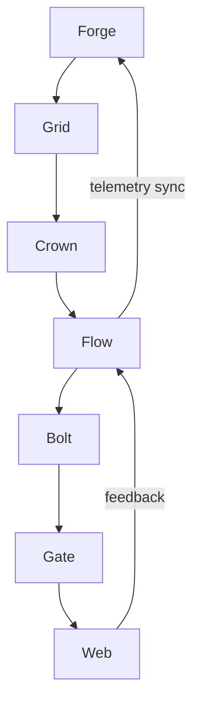

# Thunderline 2025-Q4 MVP Squad Matrix  
**Phase 1 Orchestration Specification**  
*Prepared by: Master Architect Division - Thunderline Initiative*  
*Date: 2025-Q4*  

---

## Executive Overview
The Thunderline MVP orchestration framework aligns seven cross-functional elite squads (A–G) under a single federated intelligence hierarchy. Each squad anchors a major subsystem within the Thunderline stack (Forge → Grid → Crown → Flow → Bolt → Gate → Web). The following governance defines the foundational synchronization protocol for Phase 1 execution along the 6-phase roadmap trajectory (Phase 0 → Phase 5).  

---

## Squad Charters by System Domain

### **Squad A — THUNDERFORGE / Infrastructure Synthesis**
**System Anchor:** `/lib/thunderline/thunderforge/`  
**Mission Charter:**  
Architect and maintain foundational infrastructure scaffolding for compute orchestration, execution compartments, and cluster node resilience.  
**Inputs:** System topology definitions, execution DAG schemas  
**Deliverables:** Stable forge nodes, validated orchestration registry, and redundancy metrics  
**Checkpoints:**  
- **Phase 0:** Bootstrap forge schema and init cluster  
- **Phase 2:** Stabilize distributed node handoffs  
- **Phase 4:** Achieve 99.99% node reliability across events  
**Metrics:** MTTR ≤ 10s, node spin-up latency ≤ 250ms  

---

### **Squad B — THUNDERGRID / Spatial Data Coordination**
**System Anchor:** `/lib/thunderline/thundergrid/`  
**Mission Charter:**  
Optimize multi-zone data topology, ensure data replication and spatial consistency across grid zones for federated AI training nodes.  
**Inputs:** Spatial coordinates, grid resource tables  
**Deliverables:** Grid overlay network, zone replication policy, unikernel data layer validation  
**Checkpoints:**  
- **Phase 1:** Grid API contracts formalized  
- **Phase 3:** Replication latency under 50ms  
- **Phase 5:** Global grid load-balance automated  
**Metrics:** Data consistency ≥ 99.99%, cross-zone sync time ≤ 80ms  

---

### **Squad C — THUNDERCROWN / Authority and Signing Intelligence**
**System Anchor:** `/lib/thunderline/thundercrown/`  
**Mission Charter:**  
Enforce cryptographic truth-chain and identity sovereignty. Maintain system CA, attestation topology, and signing orchestration.  
**Inputs:** Authority registry, signing DAG  
**Deliverables:** Dynamic key rotation, multi-tenant signing bridge  
**Checkpoints:**  
- **Phase 1:** Crown CA established  
- **Phase 2:** Dual-layer signing completion  
- **Phase 4:** Zero-compromise attestation verified  
**Metrics:** Signing throughput ≥ 20k txn/s, CA downtime ≤ 0.001%  

---

### **Squad D — THUNDERFLOW / Event & Telemetry Continuum**
**System Anchor:** `/lib/thunderline/thunderflow/`  
**Mission Charter:**  
Maintain the event-driven backbone connecting all runtime streams, telemetry insights, and causal workflow propagation interfaces.  
**Inputs:** Event bus schemas, telemetry pipelines  
**Deliverables:** Flow correlation service, full causal trace map, observability gateway  
**Checkpoints:**  
- **Phase 0:** Event schema finalization  
- **Phase 2:** Cross-domain linkage sync  
- **Phase 5:** Federated telemetry streaming stable  
**Metrics:** Event loss ≤ 0.001%, <30ms causal propagation time  

---

### **Squad E — THUNDERBOLT / ML Execution Core**
**System Anchor:** `/lib/thunderline/thunderbolt/`  
**Mission Charter:**  
Operate the ML infrastructure layer coordinating AutoML Driver, Training DAGs, and MLflow adapter lifecycle.  
**Inputs:** Model artifacts, training datasets  
**Deliverables:** Stable AutoML baseline, HPO executor validation, MLflow integration layer  
**Checkpoints:**  
- **Phase 1:** Training DAG generated  
- **Phase 3:** MLflow orchestration in production  
- **Phase 5:** End-to-end model retrain latency ≤ 5 min  
**Metrics:** Accuracy delta <1%, model promotion compliance 100%  

---

### **Squad F — THUNDERGATE / Policy and Security Enforcement**
**System Anchor:** `/lib/thundergate/`  
**Mission Charter:**  
Guarantee runtime policy adherence, traffic gating, and federated compliance surface for AI and system components.  
**Inputs:** Enforcement rulesets, policy catalogs  
**Deliverables:** Thunderwatch supervisor, sanction registry, identity bridge  
**Checkpoints:**  
- **Phase 0:** Policy schema defined  
- **Phase 3:** Network guardrails implemented  
- **Phase 5:** Federated policy endorsements distributed  
**Metrics:** Policy runtime latency ≤ 10ms, 100% threat detection coverage  

---

### **Squad G — THUNDERWEB / User Interaction & Visualization**
**System Anchor:** `/lib/thunderline_web/`  
**Mission Charter:**  
Deliver user-facing orchestration visibility and LiveView dashboards for operational command.  
**Inputs:** API telemetry feeds, LiveView state streams  
**Deliverables:** Command dashboards (Forge, Grid, Flow), control console UX components  
**Checkpoints:**  
- **Phase 1:** MVP dashboard deployed  
- **Phase 3:** Live telemetry integration with Flow  
- **Phase 5:** User control loops optimized under 2s feedback  
**Metrics:** UX latency ≤ 50ms, uptime ≥ 99.999%  

---

## Integration Topology — The Thunderline Operational Graph

### **Communication Flow Diagram (Phase 1–Phase 5)**

**Graph Description:**  
- **Forge → Grid:** Compute resources are spatially allocated  
- **Grid → Crown:** Identity and truth validation staged  
- **Crown → Flow:** Signing events injected into causal models  
- **Flow → Bolt:** Telemetry triggers adaptive ML updates  
- **Bolt → Gate:** Security orchestration reviewed pre-deploy  
- **Gate → Web:** Exposed visualization of operational posture  

---

## Inter-Squad Handoff Protocols

| Source Squad | Target Squad | Handoff Object | Synchronization Phase | Validation Signal |
|---------------|---------------|----------------|----------------------|------------------|
| Forge | Grid | Node topologies | Phase 1 | “Forge-Grid Sync Published” |
| Grid | Crown | Zone certificates | Phase 2 | “Cert-Block Validated” |
| Crown | Flow | Signed event manifests | Phase 3 | “Attested Flow Unlock” |
| Flow | Bolt | Telemetry feeds | Phase 4 | “AutoML Triggered” |
| Bolt | Gate | Model promotion data | Phase 5 | “Policy Bridge Commit” |
| Gate | Web | Verified API surfaces | Phase 5 | “LiveOps Deployment Signal” |

---

## Measurable Stabilization Metrics (Cross-Squad)

- **Latency Budget:** 150ms end-to-end from Forge to Web  
- **Uptime Target:** 99.995% global system resilience  
- **Telemetry Throughput:** >10M events/hr distributed  
- **Security Compliance:** Zero gate-leak accepted failures  

---

## Director-Level Operational Handshake Summary
The Thunderline 2025-Q4 MVP Phase 1 rollout formally commissions the seven elite squads under shared synchronization and unified data-contract protocols. Each charter can operate independently but must commit to telemetry and governance visibility layers to sustain federated AI operations.  
By Phase 5, the objective is “Self-regulating Federated Intelligence,” where every subsystem autonomously synchronizes state transitions and stability checkpoints across the Thunderline backbone.

**Operational Handshake:**  
Each squad will signal readiness through the `PAC Integration Layer` handshake:  
`Forge_OK → Grid_OK → Crown_OK → Flow_OK → Bolt_OK → Gate_OK → Web_OK`,  
culminating in the Director acknowledgment `Thunderline_Ready`.

---
*End of Phase 1 Orchestration Spec*