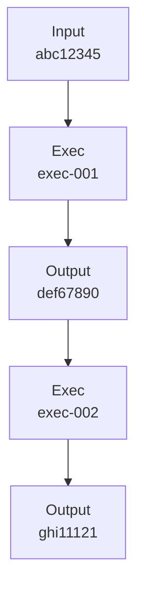

# Thundervine Domain Overview

**Vertex Position**: Data Plane Ring, Position 12

**Purpose**: Provenance & DAG Tracking - maintains immutable audit trails of all system operations with complete lineage graphs.

## Charter

Thundervine is the **memory of the system**. It records **who did what, when, and why** for every operation. It provides complete data lineage, reproducibility guarantees, and forensic analysis capabilities.

## Core Responsibilities

### 1. **Provenance Recording**
- Record every execution with full lineage
- Capture input/output hashes
- Store determinism guarantees
- Link to builds and deployments

### 2. **DAG Construction**
- Build dependency graphs (input → execution → output)
- Track data flow across executions
- Identify causal chains
- Detect circular dependencies

### 3. **Lineage Queries**
- "Show me all executions that used this input"
- "Trace output back to original sources"
- "Find all downstream consumers of this data"
- "Reconstruct execution path"

### 4. **Reproducibility**
- Store everything needed to reproduce execution
- Verify determinism guarantees
- Re-execute with identical inputs
- Compare outputs for consistency

### 5. **Audit Trails**
- Immutable records (append-only)
- Tamper detection (Merkle trees)
- Compliance reporting
- Forensic analysis

## Ash Resources

### ProvenanceRecord
```elixir
defmodule Thunderline.Thundervine.ProvenanceRecord do
  use Ash.Resource,
    domain: Thunderline.Thundervine,
    data_layer: AshPostgres.DataLayer
  
  attributes do
    uuid_primary_key :id
    attribute :execution_id, :uuid, allow_nil?: false
    attribute :build_id, :uuid, allow_nil?: false
    attribute :input_hash, :string, allow_nil?: false       # SHA256
    attribute :output_hash, :string, allow_nil?: false      # SHA256
    attribute :deterministic, :boolean, default: false
    attribute :reproducible, :boolean, default: false
    attribute :random_seed, :integer                        # If deterministic
    attribute :verified, :boolean, default: false           # Verified by re-execution
    attribute :actor_id, :uuid                              # Who triggered
    create_timestamp :recorded_at
  end
  
  relationships do
    belongs_to :execution, Thunderline.Thunderpac.Execution
    belongs_to :build, Thunderline.Thunderforge.Build
    has_many :children, __MODULE__, destination_attribute: :parent_id
    belongs_to :parent, __MODULE__
  end
  
  actions do
    defaults [:create, :read]
    
    read :by_input_hash do
      argument :hash, :string, allow_nil?: false
      filter expr(input_hash == ^arg(:hash))
    end
    
    read :by_output_hash do
      argument :hash, :string, allow_nil?: false
      filter expr(output_hash == ^arg(:hash))
    end
    
    read :lineage do
      argument :record_id, :uuid, allow_nil?: false
      prepare BuildLineageGraph
    end
  end
end
```

### DAGNode
```elixir
defmodule Thunderline.Thundervine.DAGNode do
  use Ash.Resource,
    domain: Thunderline.Thundervine,
    data_layer: AshPostgres.DataLayer
  
  attributes do
    uuid_primary_key :id
    attribute :node_type, :atom do
      constraints one_of: [:input, :execution, :output]
      allow_nil?: false
    end
    attribute :hash, :string, allow_nil?: false
    attribute :metadata, :map, default: %{}
    create_timestamp :created_at
  end
  
  relationships do
    many_to_many :parents, __MODULE__ do
      through Thunderline.Thundervine.DAGEdge
      source_attribute :id
      source_attribute_on_join_resource :child_id
      destination_attribute :id
      destination_attribute_on_join_resource :parent_id
    end
    
    many_to_many :children, __MODULE__ do
      through Thunderline.Thundervine.DAGEdge
      source_attribute :id
      source_attribute_on_join_resource :parent_id
      destination_attribute :id
      destination_attribute_on_join_resource :child_id
    end
  end
end
```

### DAGEdge
```elixir
defmodule Thunderline.Thundervine.DAGEdge do
  use Ash.Resource,
    domain: Thunderline.Thundervine,
    data_layer: AshPostgres.DataLayer
  
  attributes do
    uuid_primary_key :id
    attribute :edge_type, :atom do
      constraints one_of: [:input_to_execution, :execution_to_output, :output_to_execution]
      allow_nil?: false
    end
    create_timestamp :created_at
  end
  
  relationships do
    belongs_to :parent, Thunderline.Thundervine.DAGNode, primary_key?: true
    belongs_to :child, Thunderline.Thundervine.DAGNode, primary_key?: true
  end
  
  actions do
    defaults [:create, :read, :destroy]
  end
end
```

### LineageGraph
```elixir
defmodule Thunderline.Thundervine.LineageGraph do
  use Ash.Resource,
    domain: Thunderline.Thundervine,
    data_layer: :embedded
  
  attributes do
    attribute :root_node_id, :uuid, allow_nil?: false
    attribute :nodes, {:array, :map}, default: []
    attribute :edges, {:array, :map}, default: []
    attribute :depth, :integer, default: 0
    attribute :total_nodes, :integer, default: 0
  end
end
```

## Core Algorithms

### Recording Provenance

```elixir
defmodule Thunderline.Thundervine.Recorder do
  @moduledoc """
  Record provenance for every execution.
  Called automatically by Thunderpac after execution.
  """
  
  def record_execution(execution) do
    # Create provenance record
    {:ok, prov} = ProvenanceRecord.create!(%{
      execution_id: execution.id,
      build_id: execution.build_id,
      input_hash: execution.input_hash,
      output_hash: execution.output_hash,
      deterministic: execution.deterministic,
      reproducible: execution.reproducible,
      random_seed: execution.random_seed,
      actor_id: execution.actor_id
    })
    
    # Build DAG nodes
    input_node = find_or_create_node(:input, execution.input_hash)
    exec_node = find_or_create_node(:execution, execution.id)
    output_node = find_or_create_node(:output, execution.output_hash)
    
    # Create edges
    create_edge(input_node, exec_node, :input_to_execution)
    create_edge(exec_node, output_node, :execution_to_output)
    
    # Check if output becomes input for downstream
    link_downstream_executions(output_node)
    
    {:ok, prov}
  end
  
  defp find_or_create_node(type, hash) do
    case DAGNode.get_by_hash(hash) do
      {:ok, node} -> node
      {:error, _} ->
        DAGNode.create!(%{node_type: type, hash: hash})
    end
  end
  
  defp link_downstream_executions(output_node) do
    # Find executions that use this output as input
    ProvenanceRecord
    |> Ash.Query.filter(input_hash == ^output_node.hash)
    |> Ash.read!()
    |> Enum.each(fn downstream_prov ->
      downstream_exec = find_node(:execution, downstream_prov.execution_id)
      create_edge(output_node, downstream_exec, :output_to_execution)
    end)
  end
end
```

### Lineage Traversal

```elixir
defmodule Thunderline.Thundervine.LineageTraversal do
  @moduledoc """
  Traverse DAG to build lineage graphs.
  Supports forward (descendants) and backward (ancestors) traversal.
  """
  
  def build_lineage(node_id, direction \\ :backward, max_depth \\ 10) do
    root = DAGNode.get!(node_id)
    
    visited = MapSet.new([node_id])
    graph = %LineageGraph{
      root_node_id: node_id,
      nodes: [serialize_node(root)],
      edges: [],
      depth: 0
    }
    
    traverse(root, direction, visited, graph, 0, max_depth)
  end
  
  defp traverse(node, direction, visited, graph, depth, max_depth) do
    if depth >= max_depth do
      graph
    else
      # Get next layer (parents or children)
      next_nodes = case direction do
        :backward -> node.parents
        :forward -> node.children
      end
      
      Enum.reduce(next_nodes, {visited, graph}, fn next_node, {v, g} ->
        if MapSet.member?(v, next_node.id) do
          # Already visited (cycle detection)
          {v, g}
        else
          # Add to graph
          new_v = MapSet.put(v, next_node.id)
          new_g = %{g |
            nodes: [serialize_node(next_node) | g.nodes],
            edges: [serialize_edge(node, next_node, direction) | g.edges],
            depth: max(g.depth, depth + 1),
            total_nodes: g.total_nodes + 1
          }
          
          # Recurse
          traverse(next_node, direction, new_v, new_g, depth + 1, max_depth)
        end
      end)
    end
  end
end
```

### Reproducibility Verification

```elixir
defmodule Thunderline.Thundervine.ReproducibilityChecker do
  @moduledoc """
  Verify that executions can be reproduced with identical outputs.
  """
  
  def verify_reproducible(provenance_record_id) do
    prov = ProvenanceRecord.get!(provenance_record_id)
    
    # Re-execute with same inputs
    {:ok, new_execution} = Thunderpac.execute(%{
      build_id: prov.build_id,
      input_hash: prov.input_hash,
      random_seed: prov.random_seed
    })
    
    # Compare output hashes
    case new_execution.output_hash == prov.output_hash do
      true ->
        # Mark as verified
        ProvenanceRecord.update!(prov, %{verified: true})
        {:ok, :reproducible}
      
      false ->
        {:error, :not_reproducible, %{
          original: prov.output_hash,
          new: new_execution.output_hash
        }}
    end
  end
end
```

## Integration Points

### Vertical Edge: Gate → Vine (Rate-Limited Provenance)

```elixir
# Gate.RateLimiting checks rate limit before allowing provenance write
def record_provenance(execution) do
  case Thundergate.RateLimiting.check_rate_limit(execution.actor_id, :provenance_writes) do
    :ok ->
      Thundervine.record_execution(execution)
    
    {:error, :rate_limit_exceeded} ->
      Logger.warning("Provenance write rate limited for actor #{execution.actor_id}")
      {:error, :rate_limited}
  end
end
```

**Note**: Rate limiting functionality consolidated into ThunderGate.RateLimiting subdomain (see domain reorganization).

### Horizontal Edge: Pac → Vine (Execution Recording)

```elixir
# Pac completes execution, Vine records provenance
def handle_execution_complete(execution) do
  # Record in Vine
  {:ok, prov} = Thundervine.record_execution(execution)
  
  # Emit event for downstream
  Thunderflow.EventBus.publish_event!(%{
    name: "provenance.recorded",
    domain: "vine",
    source: :vine,
    payload: %{
      provenance_id: prov.id,
      execution_id: execution.id,
      reproducible: prov.reproducible
    }
  })
end
```

### Horizontal Edge: Flow → Vine (Event Provenance)

```elixir
# Flow events have provenance attached
Thunderflow.EventBus.publish_event!(%{
  name: "inference.completed",
  domain: "flow",
  source: :flow,
  payload: %{result: result},
  provenance: %{
    execution_id: execution.id,
    input_hash: execution.input_hash,
    output_hash: output_hash,
    reproducible: true
  }
})

# Vine indexes event provenance
Thundervine.index_event_provenance(event)
```

## Use Cases

### 1. Data Lineage Query

```elixir
# Find all outputs derived from a specific input
input_hash = "abc123..."

lineage = Thundervine.ProvenanceRecord.by_input_hash(input_hash)
|> Enum.map(fn prov ->
  # Traverse forward to find all downstream
  Thundervine.LineageTraversal.build_lineage(prov.id, :forward)
end)

# Result: Full DAG of input → executions → outputs
```

### 2. Reproducibility Check

```elixir
# Verify an execution can be reproduced
prov_id = "..."

case Thundervine.verify_reproducible(prov_id) do
  {:ok, :reproducible} ->
    IO.puts("Execution is reproducible ✓")
  
  {:error, :not_reproducible, diff} ->
    IO.puts("Execution is NOT reproducible ✗")
    IO.inspect(diff)
end
```

### 3. Forensic Analysis

```elixir
# Investigate anomaly by tracing lineage
anomalous_output_hash = "xyz789..."

# Find provenance record
prov = Thundervine.ProvenanceRecord.by_output_hash(anomalous_output_hash)

# Trace backward to original inputs
lineage = Thundervine.LineageTraversal.build_lineage(prov.id, :backward)

# Identify root causes
root_inputs = lineage.nodes
|> Enum.filter(&(&1.node_type == :input))
|> Enum.map(& &1.hash)
```

### 4. Compliance Reporting

```elixir
# Generate audit report for time range
start_date = ~D[2024-01-01]
end_date = ~D[2024-01-31]

report = Thundervine.ProvenanceRecord
|> Ash.Query.filter(recorded_at >= ^start_date and recorded_at <= ^end_date)
|> Ash.read!()
|> Enum.group_by(& &1.build_id)
|> Enum.map(fn {build_id, provs} ->
  %{
    build_id: build_id,
    total_executions: length(provs),
    reproducible: Enum.count(provs, & &1.reproducible),
    verified: Enum.count(provs, & &1.verified)
  }
end)
```

## DAG Visualization

### Mermaid Export

```elixir
defmodule Thunderline.Thundervine.MermaidExporter do
  def export_lineage(lineage_graph) do
    nodes = Enum.map(lineage_graph.nodes, fn node ->
      label = case node.node_type do
        :input -> "Input<br/>#{String.slice(node.hash, 0, 8)}"
        :execution -> "Exec<br/>#{String.slice(node.id, 0, 8)}"
        :output -> "Output<br/>#{String.slice(node.hash, 0, 8)}"
      end
      
      "#{node.id}[\"#{label}\"]"
    end)
    
    edges = Enum.map(lineage_graph.edges, fn edge ->
      "#{edge.parent_id} --> #{edge.child_id}"
    end)
    
    """
    graph TD
    #{Enum.join(nodes, "\n")}
    #{Enum.join(edges, "\n")}
    """
  end
end
```

Example output:


## Telemetry Events

```elixir
[:thunderline, :vine, :provenance, :recorded]      # Provenance recorded
[:thunderline, :vine, :dag, :node_created]         # DAG node created
[:thunderline, :vine, :dag, :edge_created]         # DAG edge created
[:thunderline, :vine, :lineage, :queried]          # Lineage query
[:thunderline, :vine, :reproducibility, :verified] # Reproducibility verified
[:thunderline, :vine, :reproducibility, :failed]   # Reproducibility failed
```

## Performance Targets

| Operation | Latency (P50) | Latency (P99) | Throughput |
|-----------|--------------|--------------|------------|
| Record provenance | 10ms | 50ms | 1k/s |
| Create DAG node | 5ms | 20ms | 2k/s |
| Create DAG edge | 5ms | 20ms | 2k/s |
| Lineage query (depth 5) | 50ms | 200ms | 100/s |
| Reproducibility check | 100ms | 500ms | 10/s |

## Storage Considerations

### Data Volume Estimates
- **Provenance record**: ~500 bytes
- **DAG node**: ~200 bytes
- **DAG edge**: ~100 bytes
- **Lineage graph**: ~10 KB (depth 5)

### Retention Policies
```elixir
# Archive old provenance records
CronJob.create!(%{
  name: "archive_old_provenance",
  cron_expression: "0 3 * * *",  # 3 AM daily
  action: %{
    module: Thundervine,
    function: :archive_records_older_than,
    args: [90, :days]
  }
})

# Compress lineage graphs
CronJob.create!(%{
  name: "compress_lineage_graphs",
  cron_expression: "0 4 * * 0",  # 4 AM every Sunday
  action: %{
    module: Thundervine,
    function: :compress_unused_graphs,
    args: []
  }
})
```

## Testing Strategy

### Unit Tests
- Provenance record creation
- DAG node/edge creation
- Lineage traversal algorithms
- Hash computation

### Integration Tests
- End-to-end provenance recording
- Multi-hop lineage queries
- Reproducibility verification
- Rate-limited writes (with Jam)

### Property Tests
- DAG acyclicity (no cycles)
- Lineage completeness (all paths found)
- Hash uniqueness
- Traversal correctness

## Development Phases

### Phase 1: Foundation
- [ ] Create domain module
- [ ] Define Ash resources (ProvenanceRecord, DAGNode, DAGEdge)
- [ ] Basic provenance recording
- [ ] Simple lineage queries

### Phase 2: Production Features
- [ ] DAG construction and traversal
- [ ] Reproducibility verification
- [ ] Rate limit integration (Jam)
- [ ] Telemetry instrumentation

### Phase 3: Advanced Features
- [ ] Merkle tree for tamper detection
- [ ] Distributed provenance (multi-region)
- [ ] Real-time lineage updates
- [ ] Visualization export (Mermaid, D3.js)

## References

- [Prism Topology](../../architecture/PRISM_TOPOLOGY.md)
- [Horizontal Rings](../../architecture/HORIZONTAL_RINGS.md)
- [Vertical Edges](../../architecture/VERTICAL_EDGES.md)
- [ThunderDSL Specification](../../THUNDERDSL_SPECIFICATION.md)
