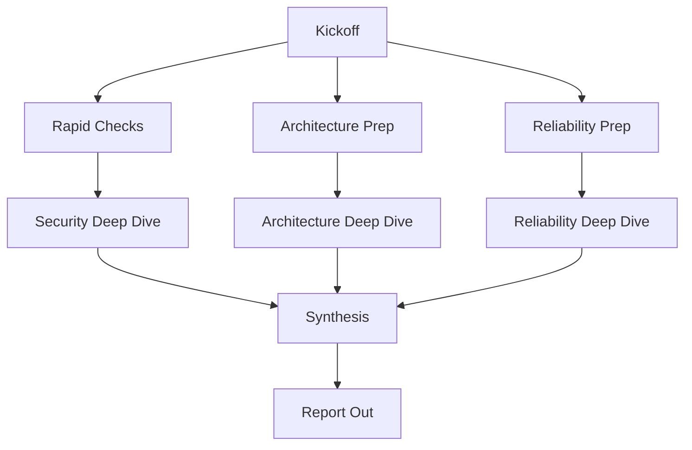

# Thunderline Comprehensive Audit Plan

## 1. Overview
- **Scope**: Full-stack security, architecture, and reliability review across Phoenix services, Ash domains, Thunderflow events, Thunderbolt ML, Thunderlink transport, thunderhelm Python components, and deployment manifests.
- **Audience**: Security reviewers, architecture analysts, reliability engineers executing downstream assessments.
- **Baseline References**: [THUNDERLINE_DOMAIN_CATALOG.md](THUNDERLINE_DOMAIN_CATALOG.md:1), [THUNDERLINE_MASTER_PLAYBOOK.md](THUNDERLINE_MASTER_PLAYBOOK.md:1), [HOW_TO_AUDIT.md](HOW_TO_AUDIT.md:1), [docs/DOMAIN_SECURITY_PATTERNS.md](docs/DOMAIN_SECURITY_PATTERNS.md:1), [PYTHON_SERVICES.md](PYTHON_SERVICES.md:1).

## 2. Track Goals and Success Criteria
| Track | Primary Goals | Success Criteria |
|---|---|---|
| Security | Validate Ash policy enforcement, credential management, ingress hardening, and data isolation across Elixir and Python surfaces. | 0 open P0 policy violations, tenant isolation verified, secret inventory reconciled, SBOM and trivy runs archived with actionable issues. |
| Architecture | Confirm domain boundary integrity, supervision topology, event taxonomy alignment, and contract adherence across Thunder domains and supporting services. | Boundary violations enumerated with remediation owners, canonical topology diagrams updated, event linter gating strategy approved. |
| Reliability & Observability | Assess telemetry coverage, failure handling, recovery runbooks, chaos readiness, and operational tooling in Elixir and thunderhelm pipelines. | Core SLO dashboards referenced, DLQ visibility plan delivered, failure injection playbook refreshed, on-call escalation flow confirmed. |

## 3. Subsystem-to-Focus-Area Map
| Subsystem / Domain | Description | Audit Focus | Track | Key Artifacts |
|---|---|---|---|---|
| ThunderGate | Authentication, authorization, rate limiting, Magika ingress ML. | Policy coverage, API key issuance, Magika sandboxing, ingress telemetry. | Security | [lib/thunderline/thundergate/domain.ex](lib/thunderline/thundergate/domain.ex:1) [docs/DOMAIN_SECURITY_PATTERNS.md](docs/DOMAIN_SECURITY_PATTERNS.md:1) [docs/MAGIKA_QUICK_START.md](docs/MAGIKA_QUICK_START.md:1) |
| ThunderBlock | Persistence, retention, timing, vault resources. | Policy remediation status, retention jobs, timer consolidation after ThunderClock merge. | Security & Reliability | [lib/thunderline/thunderblock/domain.ex](lib/thunderline/thunderblock/domain.ex:1) [lib/thunderline/domain_docs/thunderblock/OVERVIEW.md](lib/thunderline/domain_docs/thunderblock/OVERVIEW.md:1) |
| ThunderBolt | ML orchestration, Cerebros bridge, UPM lifecycle. | Bridge configurations, ML migrations, Thunderhelm coupling, model registry governance. | Architecture & Reliability | [lib/thunderline/thunderbolt/cerebros_bridge/invoker.ex](lib/thunderline/thunderbolt/cerebros_bridge/invoker.ex:1) [docs/cerebros_nas_saga.md](docs/cerebros_nas_saga.md:1) [PYTHON_SERVICES.md](PYTHON_SERVICES.md:15) |
| ThunderFlow | Event bus, Broadway pipelines, telemetry relays. | Event taxonomy compliance, DLQ handling, retry policies, cross-domain leak mitigation. | Architecture & Reliability | [lib/thunderline/thunderflow/event_bus.ex](lib/thunderline/thunderflow/event_bus.ex:1) [docs/EVENT_TAXONOMY.md](docs/EVENT_TAXONOMY.md:1) [docs/EVENT_RETRY_STRATEGIES.md](docs/EVENT_RETRY_STRATEGIES.md:1) |
| ThunderLink | Transport layer, presence, TOCP prep. | Boundary violations to ThunderBlock, presence policies, transport reliability metrics. | Security & Reliability | [lib/thunderline/thunderlink/transport/reliability.ex](lib/thunderline/thunderlink/transport/reliability.ex:1) [lib/thunderline/thunderlink/resources/link_session.ex](lib/thunderline/thunderlink/resources/link_session.ex:1) |
| ThunderCom | Messaging, voice, federation content. | Voice pipeline gap analysis, Ash resource policies, integration with ThunderLink transport. | Architecture & Security | [lib/thunderline/thunderlink/voice/room_pipeline.ex](lib/thunderline/thunderlink/voice/room_pipeline.ex:1) [docs/test/thundercom/voice/voice_room_pipeline_test.exs](docs/test/thundercom/voice/voice_room_pipeline_test.exs:1) |
| ThunderGrid & ThunderVine | Spatial and workflow DAG orchestration. | Policy coverage, graph traversal safety, DAG compaction alignment. | Architecture | [lib/thunderline/thundergrid/resources/zone.ex](lib/thunderline/thundergrid/resources/zone.ex:1) [lib/thunderline/thundervine/workflow_compactor.ex](lib/thunderline/thundervine/workflow_compactor.ex:1) |
| ThunderChief & Service Registry | Cross-domain coordination and health monitoring. | Job orchestration governance, service registration accuracy, health check telemetry. | Architecture & Reliability | [lib/thunderline/thunderchief/orchestrator.ex](lib/thunderline/thunderchief/orchestrator.ex:1) [lib/thunderline/service_registry/health_monitor.ex](lib/thunderline/service_registry/health_monitor.ex:1) |
| Thunderprism | Graph topology visualisation and LiveView endpoints. | Routing boundaries, controller policy interaction, LiveView security baseline. | Architecture | [lib/thunderline/thunderprism/prism_node.ex](lib/thunderline/thunderprism/prism_node.ex:1) [lib/thunderline_web/controllers/thunderprism_controller.ex](lib/thunderline_web/controllers/thunderprism_controller.ex:1) |
| Web & Auth Surfaces | Phoenix controllers, LiveView, AshAuthentication integration. | Session management, CSRF/token handling, role propagation into actor context. | Security | [lib/thunderline_web/endpoint.ex](lib/thunderline_web/endpoint.ex:1) [lib/thunderline_web/user_socket.ex](lib/thunderline_web/user_socket.ex:1) |
| Thunderhelm Python Services | Cerebros NAS backend, MLflow server, runner POCs. | Deployment automation, health checks, credentials, network ACL alignment. | Architecture & Reliability | [PYTHON_SERVICES.md](PYTHON_SERVICES.md:15) [thunderhelm/cerebros_service/cerebros_service.py](thunderhelm/cerebros_service/cerebros_service.py:1) [thunderhelm/deploy/cerebros_runner_poc.py](thunderhelm/deploy/cerebros_runner_poc.py:1) |
| Infrastructure & Deploy | docker-compose, fly.io config, deployment manifests. | Secret distribution, port exposure, runtime env parity, CI guardrails. | Security & Reliability | [docker-compose.yml](docker-compose.yml:1) [fly.toml](fly.toml:1) [deploy/unikernel/SECURITY.md](deploy/unikernel/SECURITY.md:1) |
| Documentation & Runbooks | Master playbook, audit guides, runbooks. | Cross-check doc vs implementation drift, identify stale protocols. | Architecture & Reliability | [THUNDERLINE_MASTER_PLAYBOOK.md](THUNDERLINE_MASTER_PLAYBOOK.md:1) [HOW_TO_AUDIT.md](HOW_TO_AUDIT.md:1) [docs/older/planning/HC_EXECUTION_PLAN.md](docs/older/planning/HC_EXECUTION_PLAN.md:1) |

## 4. Evidence Checklist by Track
### 4.1 Security
- Policy remediation status for high-risk resources: [lib/thunderline/thunderblock/resources/vault_experience.ex](lib/thunderline/thunderblock/resources/vault_experience.ex:1), [lib/thunderline/thunderlink/resources/link_session.ex](lib/thunderline/thunderlink/resources/link_session.ex:1), cross-check with [docs/DOMAIN_SECURITY_PATTERNS.md](docs/DOMAIN_SECURITY_PATTERNS.md:18).
- Credential and secret inventory: [docker-compose.yml](docker-compose.yml:1), [fly.toml](fly.toml:1), [config/runtime.exs](config/runtime.exs:1).
- Ingress and authentication flows: [lib/thunderline_web/endpoint.ex](lib/thunderline_web/endpoint.ex:1), [lib/thunderline/thundergate/authentication/magic_link_sender.ex](lib/thunderline/thundergate/authentication/magic_link_sender.ex:1), [lib/thunderline_web/user_socket.ex](lib/thunderline_web/user_socket.ex:1).
- CI security gates: [mix.exs](mix.exs:1) (alias `mix precommit`), [.gitleaks.toml](.gitleaks.toml:1), [.trivyignore](.trivyignore:1).
- Tooling outputs to archive: sobelow (`mix sobelow --exit`), gitleaks (`gitleaks detect --config .gitleaks.toml`), trivy (`trivy fs . --ignorefile .trivyignore --format json`).

### 4.2 Architecture
- Domain contracts and catalogs: [THUNDERLINE_DOMAIN_CATALOG.md](THUNDERLINE_DOMAIN_CATALOG.md:8), [lib/thunderline/domain_docs/thunderblock/OVERVIEW.md](lib/thunderline/domain_docs/thunderblock/OVERVIEW.md:1).
- Supervision tree & routing: [lib/thunderline/service_registry/service.ex](lib/thunderline/service_registry/service.ex:1), [lib/thunderline/service_registry/health_monitor.ex](lib/thunderline/service_registry/health_monitor.ex:1), [lib/thunderline/thunderflow/event_bus.ex](lib/thunderline/thunderflow/event_bus.ex:1).
- Event taxonomy & lint outputs: [docs/EVENT_TAXONOMY.md](docs/EVENT_TAXONOMY.md:1), [docs/test/mix/tasks/events_lint_task_test.exs](docs/test/mix/tasks/events_lint_task_test.exs:1).
- Graph & workflow docs: [docs/architecture/PRISM_TOPOLOGY.md](docs/architecture/PRISM_TOPOLOGY.md:1), [documentation/thunderlink_node_registry_progress.md](documentation/thunderlink_node_registry_progress.md:1).
- Python coupling diagrams: [PYTHON_SERVICES.md](PYTHON_SERVICES.md:69), [docs/AI_ML_INTEGRATION_GUIDE.md](docs/AI_ML_INTEGRATION_GUIDE.md:1).

### 4.3 Reliability & Observability
- Telemetry baselines: [lib/thunderline_web/telemetry.ex](lib/thunderline_web/telemetry.ex:1), [lib/thunderline/thunderflow/telemetry/oban_stats.ex](lib/thunderline/thunderflow/telemetry/oban_stats.ex:1), [SHIPLOG_ML_PIPELINE.md](SHIPLOG_ML_PIPELINE.md:1).
- Queue health and DLQ handling: [lib/thunderline/thunderflow/broadway_producer.ex](lib/thunderline/thunderflow/broadway_producer.ex:1), [docs/test/thunderflow/event_bus_telemetry_test.exs](docs/test/thunderflow/event_bus_telemetry_test.exs:1).
- Runbooks & operations: [THUNDERLINE_MASTER_PLAYBOOK.md](THUNDERLINE_MASTER_PLAYBOOK.md:105), [docs/EVENT_TROUBLESHOOTING.md](docs/EVENT_TROUBLESHOOTING.md:1), [deploy/unikernel/README.md](deploy/unikernel/README.md:1).
- Python service health: [PYTHON_SERVICES.md](PYTHON_SERVICES.md:44), [thunderhelm/deploy/cerebros_runner_poc.py](thunderhelm/deploy/cerebros_runner_poc.py:1).
- Testing harnesses: [docs/test/thunderline/integration/cross_domain_trace_test.exs](docs/test/thunderline/integration/cross_domain_trace_test.exs:1), [docs/test/thunderline/thunderbolt/upm/trainer_worker_test.exs](docs/test/thunderline/thunderbolt/upm/trainer_worker_test.exs:1).

## 5. Sequencing and Dependencies
| Phase | Description | Duration | Dependencies | Deliverables |
|---|---|---|---|---|
| Phase 0 – Kickoff & Baseline | Confirm catalog currency, gather stakeholders, align audit tooling. | 0.5 day | None | Entry brief, shared evidence workspace, contact roster. |
| Phase 1 – Rapid Risk Sweep | Execute high-risk checks: gitleaks, sobelow, policy spot checks, DLQ visibility. | 1 day | Phase 0 | Rapid risk bulletin, blocking issues escalated. |
| Phase 2 – Deep Dives | Track-specific deep inspections per sections 4 and 7. | 3 days | Phase 1 | Detailed findings logs, remediation backlog with severity. |
| Phase 3 – Integration & Validation | Cross-verify architecture and reliability findings, replay critical flows, validate instrumentation. | 1 day | Phase 2 | Updated topology diagrams, failover test notes, instrumentation diffs. |
| Phase 4 – Synthesis & Handoff | Consolidate results, prepare executive summary, schedule remediation owners. | 0.5 day | Phase 3 | Draft executive summary, remediation tracker, final checklist sign-off. |

## 6. Recommended Tooling and Automation
- Phoenix/Ash: `mix precommit`, `mix sobelow --exit`, `mix credo --strict`, `mix test --only guardrail`, `mix thunderline.events.lint`.
- Security scanning: `gitleaks detect --config .gitleaks.toml --report-path reports/gitleaks.json`, `trivy fs . --ignorefile .trivyignore --format json --output reports/trivy.json`.
- Observability review: LiveDashboard, Grafana exports [priv/grafana/magika_dashboard.json](priv/grafana/magika_dashboard.json:1), OpenTelemetry collector traces.
- Python services: virtualenv scripts in thunderhelm, MLflow API smoke checks, health endpoints (`/health`).
- Evidence repository: shared folder with timestamped outputs, align with [HOW_TO_AUDIT.md](HOW_TO_AUDIT.md:487) reporting template.

## 7. High-Risk Rapid Checks vs Deep Investigations
| Track | Rapid Checks (Day 1) | Deep Investigations (Phases 2–3) |
|---|---|---|
| Security | Verify absence of `authorize_if always()` in priority resources, run sobelow, confirm secrets not committed, inspect Magika sandbox flags. | Full Ash policy audit per domain, credential rotation procedures, Magika model provenance and threat modeling, review API key issuance workflow end-to-end. |
| Architecture | Check for direct Repo or boundary leaks via grep, confirm event linter passes, review top-level supervision tree. | Walk domain docs vs code, reconstruct Thunderflow to Thunderbolt to Thunderlink sequence diagrams, validate Thunderhelm interface contracts, confirm GraphQL schema alignment. |
| Reliability | Inspect DLQ queue depth, ensure telemetry endpoints emit, verify Oban jobs reporting. | Chaos testing playbook review, failover simulations, model retraining pipeline resilience analysis, cross-region or offline device recovery exercises. |

## 8. Open Questions and Assumptions
1. Confirm latest update of [THUNDERLINE_DOMAIN_CATALOG.md](THUNDERLINE_DOMAIN_CATALOG.md:1) reflects recent consolidations (ThunderJam, ThunderClock).
2. Identify owner for Thunderlink → ThunderBlock boundary remediation noted in [docs/CODEBASE_STATUS.md](docs/CODEBASE_STATUS.md:10).
3. Validate availability of thunderhelm deployment automation or whether manual boot remains acceptable for audit timeline.
4. Determine target environment(s) for tooling execution (local, staging, production-like).
5. Clarify acceptable risk thresholds for DLQ backlog and telemetry gaps to prioritize findings.
6. Confirm access to Grafana and application logs for external reviewers.

## 9. Deliverables and Handoffs
- Track-specific findings log (security, architecture, reliability) with severity, owner, remediation ETA.
- Evidence archive containing tool outputs, configuration captures, diagrams, and logs.
- Updated domain and topology diagrams aligned with [THUNDERLINE_MASTER_PLAYBOOK.md](THUNDERLINE_MASTER_PLAYBOOK.md:45).
- Executive summary mapping findings to HC action matrix in [THUNDERLINE_MASTER_PLAYBOOK.md](THUNDERLINE_MASTER_PLAYBOOK.md:7).
- Remediation backlog inserted into shared tracker with audit references.

## 10. Coordination Flow

## 11. Communication Cadence
- Daily 15-minute triage stand-up with track leads.
- End-of-phase readout summarizing discoveries and blockers.
- Shared audit log capturing evidence pointers, decisions, outstanding risks.

## 12. Next Steps
- Secure approval of this plan.
- Assign leads per track and confirm resource availability.
- Schedule tooling windows and environment access checks.