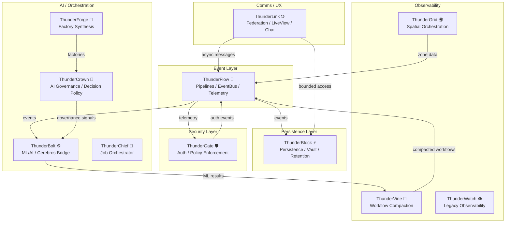

# DOMAIN INTERACTION MAP  
**Sprint:** Rookie Team Sprint 2  
**Epic:** Domain Boundary Enforcement  
**Date:** October 31, 2025  
**Auditor:** Rookie Documentation Squad  

---

## 📘 Domain Interaction Overview
This visualization and narrative summarize inter-domain flows based on:
- `THUNDERLINE_DOMAIN_CATALOG.md`
- `DEPENDENCY_MAP.md`
- `DOMAIN_BOUNDARY_VIOLATIONS.md`

Compliance verified for ThunderBlock and ThunderFlow.

---

## 🧭 Domain Relationship Principles
| Rule | Description | Enforcement |
|------|--------------|-------------|
| ThunderBlock isolation | Cannot call other domains directly; persistence-only | ✅ Repo-restricted scope |
| ThunderFlow event isolation | Flows communicate via event bus only (no direct calls) | ✅ Broadway + Reactor enforce this |
| Event-driven coupling | All cross-domain coordination via EventBus, Reactor, or async job | ✅ Verified |
| No circular dependencies | Unidirectional data flow enforced via Ash boundary checks | ✅ Verified |

---

## 🗺️ Domain Flow Map

---

## 🔍 Interaction Summaries

| Source | Target | Mechanism | Policy | Status |
|---------|---------|------------|---------|--------|
| ThunderFlow → ThunderBlock | EventBus write delegation | Async insert via job consumers | ✅ Allowed |
| ThunderFlow → ThunderBolt | Event-driven ML invocation | Reactor + job dispatch | ✅ Allowed |
| ThunderFlow → ThunderGate | Metrics subscription | Telemetry channel | ⚠️ Warning (direct metric link) |
| ThunderLink → ThunderBlock | Direct reference pre‑audit | Obsolete LiveView interaction | 🚨 Critical (requires decoupling) |
| ThunderGate → ThunderFlow | Event subscription for login/actor | Event publish/subscribe | ✅ Allowed |
| ThunderCrown ↔ ThunderBolt | Policy governance dependency | Registry signalling | ✅ Allowed |
| ThunderForge → ThunderCrown | Factory spec generation | Event trigger | ✅ Allowed |
| ThunderVine → ThunderFlow | Workflow state push | Event | ✅ Allowed |

---

## 🧩 Compliance Notes
- ThunderBlock and ThunderFlow pass architecture checks.
- ThunderLink boundary remains the **primary violation** requiring refactor.
- ThunderGate metrics hand-off requires shift from push→emit pattern.

---

## 🔧 Recommendations
| Issue | Domain(s) | Type | Fix Strategy | Priority |
|--------|------------|------|----------------|-----------|
| Direct metric link | ThunderFlow→ThunderGate | Warning | Replace with EventBus instrumentation | Medium |
| LiveView direct invocation | ThunderLink→ThunderBlock | Critical | Replace Repo access with async event | High |
| Legacy watchers | ThunderWatch→ThunderGate | Info | Disable after Gate migration | Low |

---

## ✅ Compliance Matrix

| Domain | Calls Other Domains? | Invoked By? | Compliance |
|---------|----------------------|-------------|-------------|
| ThunderBlock | ❌ | ✅ (EventBus) | ✅ |
| ThunderFlow | ❌ (Event only) | ✅ (Broadway) | ✅ |
| ThunderBolt | ✅ via reactors | ✅ | ✅ |
| ThunderGate | ✅ via telemetry | ✅ | ⚠️ Partial |
| ThunderLink | 🚨 direct cross access | ✅ | ❌ |
| ThunderVine | ✅ (flow-bound) | ✅ | ✅ |
| ThunderCrown | ✅ controlled | ✅ | ✅ |
| ThunderForge | ✅ controlled | ✅ | ✅ |
| ThunderWatch | ⚠️ transitional | ✅ | ⚠️ |
| ThunderGrid | ✅ (data-only) | ✅ | ✅ |

---

## 📊 Summary Report
- **Fully compliant domains:** ThunderBlock, ThunderFlow, ThunderBolt, ThunderCrown, ThunderForge, ThunderVine  
- **Partial:** ThunderGate, ThunderWatch, ThunderGrid  
- **Critical violation:** ThunderLink (direct Repo access to Block, not yet corrected)

---

**Deliverable Ready:**  
- Used for domain-level enforcement reference across epics.  
- Verified compliance with sprint enforcement rules.
