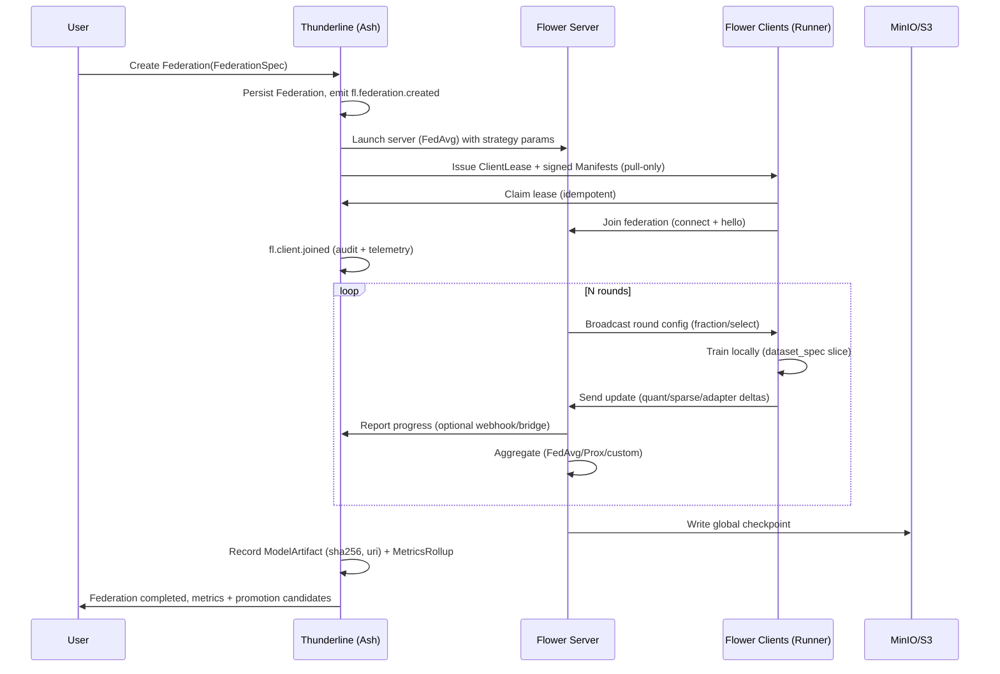

# Architecture

This platform orchestrates federated model training where compute moves to the data. Thunderline acts as the control-plane “brain” with strict governance (Ash + Postgres), Flower provides the federated training runtime (server + clients), while Automat0/Cerebros supply execution paths where needed. Artifacts (models, logs) land in S3-compatible storage; signals and health feed observability stacks.

Planes
- Control plane (Thunderline)
  - Phoenix + Ash 3.x on Postgres
  - Ash resources (proposed): Federation, FLRound, ClientLease, ModelArtifact, MetricsRollup
  - Actions emit outbox events (fl.*) and enforce policy (RLS/permissions)
- Federation plane (Flower)
  - Flower server (FedAvg baseline; pluggable strategies)
  - Clients run on edge/worker nodes; pull-only over mTLS; manifests are signed (JWS)
- Execution plane (Automat0/Cerebros) [optional]
  - Automat0 umbrella apps for ingest/tokenization/worker orchestration
  - Cerebros Python pipelines for model training/evaluation
- Artifact plane (MinIO/S3)
  - Global checkpoints, adapter deltas, logs (content-addressed; sha256 lineage in PG)
- Observability plane
  - OTLP traces for round lifecycle; Prometheus metrics; Grafana dashboards

High-level flow (sequence)

Core contracts
- FederationSpec (YAML)
  - model_ref: base checkpoint/arch reference
  - strategy: fedavg|fedprox|custom (+ params)
  - num_rounds, client_fraction
  - dp: {epsilon, delta} (optional)
  - secure_agg: true|false
  - client_selector: {tenant, tags, embedding_query}
  - dataset_spec: {uris, shards, hashes}
- Ash resources (PG-backed)
  - Federation(id, spec_yaml, status, tenant_id, created_by, started_at, completed_at)
  - FLRound(id, federation_id, round_num, status, metrics_json, started_at, completed_at)
  - ClientLease(id, federation_id, client_id, manifest_uri, lease_expires_at, epochs_max, tokens_max, status)
  - ModelArtifact(id, federation_id, round_id, uri, sha256, size_bytes, format, created_at)
  - MetricsRollup(id, federation_id, round_id, aggregates_json)
- Events (outbox; examples)
  - fl.federation.created|started|completed|failed
  - fl.client.lease_issued|joined|dropped
  - fl.round.started|completed
  - fl.aggregate.completed

Security and governance
- All writes pass through Ash actions; events are audited
- Tenant isolation with RLS; API surfaces are least-privilege
- Runner channel uses mTLS; manifests are signed (JWS) with short-lived identities
- Optional DP and secure aggregation toggles per FederationSpec

Topology
- Minimal profile
  - thunderline-web (Phoenix endpoint)
  - thunderline-worker (pipelines/Oban + telemetry)
  - flower-federation (Python) [optional]
  - External Postgres, MinIO/S3, OTLP, Prom/Grafana
- Scaled profile
  - Multiple worker replicas (HPA)
  - Separate federation pools (labels/taints for GPU)
  - Edge clients on nodes close to data (phones/Pis/Jetsons/PCs)

SLOs and KPIs (examples)
- Round p95 latency (seconds)
- Join success rate (%)
- Effective tokens/sec (global and per-client)
- Watts per token (client-reported via power probes)
- Artifact write success and time-to-availability

Notes
- Start with FedAvg; add FedProx for heterogeneity and custom weighting (recency/entropy)
- Prefer adapter/LoRA deltas and quantized/sparse updates to reduce bandwidth
- Use pgvector for intelligent client selection (embedding queries) in future iterations
